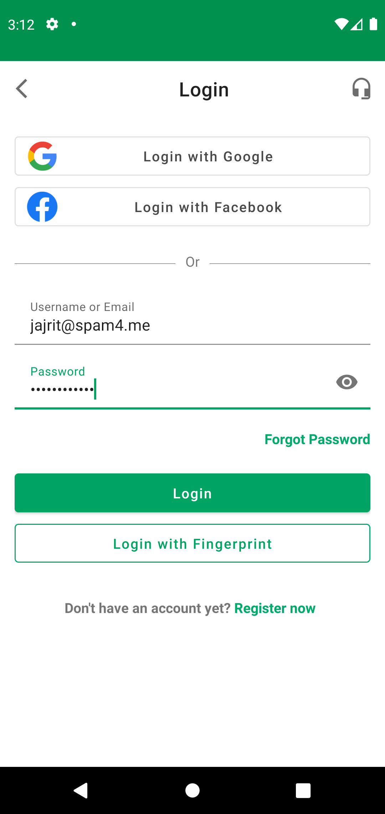
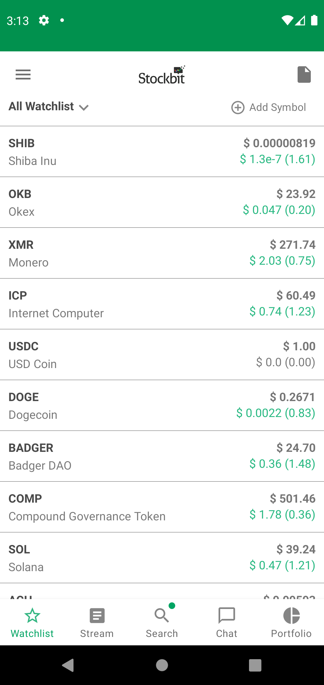

# MiniStockBit App Demo

## Requirements
- Android Studio 4.2 + SDK
- Android Gradle Plugin 4.2.1
- Gradle 6.8.3
- Git
- API using `https://min-api.cryptocompare.com/`

## How to Run
- clone this project using git and open this project using Android Studio
- after finish resolved dependencies and indexing, you may want to change `apiKey` inside `gradle.properties` file
- click run

## Screenshots

| SplashScreen | LoginScreen | MainScreen |
|---|---|---|
| | |  |
